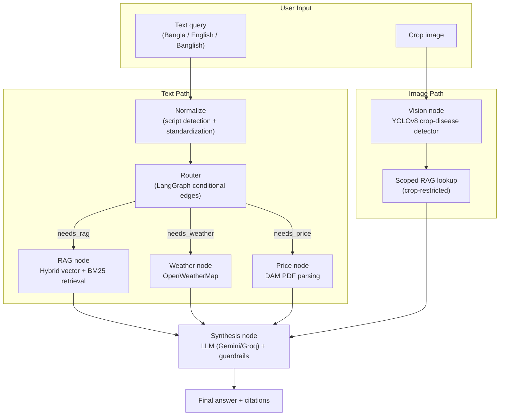

# KrishokBot (কৃষকবট)

An agentic, source-grounded advisory assistant for Bangladeshi farmers — built as a retrieval-augmented, tool-calling agent with an integrated crop disease vision model, entirely in Bengali.

KrishokBot answers agriculture questions by routing each query through a LangGraph agent that decides, per query, whether it needs document retrieval (RAG), live weather data, live market prices, or crop-disease image analysis — then synthesizes a single grounded answer with source citations.

---

## Table of Contents

- [Problem Statement](#problem-statement)
- [Key Features](#key-features)
- [System Architecture](#system-architecture)
- [Project Structure](#project-structure)
- [Vision Model Performance](#vision-model-performance)
- [RAG Pipeline Design Notes](#rag-pipeline-design-notes)
- [Guardrails](#guardrails)
- [Tech Stack](#tech-stack)
- [Quick Start](#quick-start)
- [Evaluation](#evaluation)
- [Known Limitations](#known-limitations)
- [Author](#author)

---

## Problem Statement

Bangladeshi farmers need fast, trustworthy answers to practical questions — crop disease identification, weather-dependent decisions, and current market prices — but this information is scattered across government PDFs, static market reports, and manual field inspection. Most farmer-facing chatbot prototypes are thin wrappers around a single LLM call with no retrieval grounding, no tool access, and no way to verify an answer against a source.

KrishokBot is built as a genuine agentic system rather than a "chat with PDF" clone: a router decides per-query which combination of retrieval, weather, market-price, and vision tools is actually needed, and every document-grounded answer carries a source and page citation rather than an unverifiable LLM claim.

---

## Key Features

- **Agentic routing, not a fixed pipeline** — a LangGraph router inspects each normalized query and dispatches only the tools that query actually needs (RAG, weather, price, or a fan-out combination), rather than always running every step.
- **Script-agnostic input** — a normalization stage detects Bangla, English, or Banglish (romanized Bangla) input and standardizes it to Bangla before retrieval, since the entire document corpus is Bangla-script.
- **Hybrid retrieval (vector + BM25)** — pure vector search on this corpus was empirically found to under-rank short, keyword-dense diagnostic chunks (a real blast-disease query failed to surface the single most authoritative document even at top_k=50). Vector search is fused with BM25 keyword search via Reciprocal Rank Fusion to fix this.
- **OCR-first PDF ingestion** — direct PDF text extraction on this corpus was found to silently produce word-corrupted (but still valid-looking) Bangla Unicode on some documents. Every page is rendered and OCR'd by default after this was verified against direct extraction on real corpus PDFs.
- **Integrated crop-disease vision model** — a self-trained YOLOv8 detector identifies 11 disease/health classes across rice, potato, and tomato from a photo, then automatically triggers a scoped RAG lookup restricted to that crop so the follow-up advice can't cite the wrong crop's documents.
- **Live external tools** — real-time weather (OpenWeatherMap, by Bangladeshi division) and live DAM (Department of Agricultural Marketing) retail price lookups, parsed directly from the department's published PDF reports rather than a static snapshot.
- **Citations, not raw chunk dumps** — the UI shows source document and page number for every document-grounded claim; raw OCR'd chunk text is never surfaced directly to the user, since chunk edges can contain broken sentences.
- **Guardrails** — prompt-injection heuristics on both user input and retrieved document chunks, and confidence-tier-aware language enforcement so a low-confidence vision detection is never phrased as a certain diagnosis.
- **Evaluation harness** — a routing-correctness and retrieval-hit-rate test suite, with RAGAS metric hooks (faithfulness, answer relevancy, context precision/recall) wired in for LLM-graded evaluation.

---

## System Architecture



---

## Project Structure

```
krishokbot/
│
├── agent/
│   ├── graph.py            # LangGraph StateGraph: normalize -> route -> rag/weather/price -> synthesis
│   ├── normalizer.py        # Script detection (Bangla/English/Banglish) + standardization
│   ├── router.py             # Query routing decisions
│   ├── tools.py               # Weather (OpenWeatherMap) + DAM market price PDF parsing
│   ├── guardrails.py          # Prompt-injection heuristics, uncertainty-language enforcement
│   ├── llm_provider.py        # Gemini / Groq provider abstraction
│   ├── prompts.py             # Synthesis system/user prompt templates
│   └── config.py
│
├── rag/
│   ├── ingest.py               # PDF -> OCR -> clean -> chunk -> embed -> ChromaDB
│   ├── retriever.py            # Hybrid vector + BM25 retrieval with Reciprocal Rank Fusion
│   ├── pdf_extract.py          # OCR-first extraction (handles word-corrupted text layers)
│   ├── text_clean.py           # Garbage-line filtering, header/footer removal
│   ├── config.py               # Centralized pipeline configuration
│   ├── INGESTION_REPORT.md     # Real ingestion run: 20 documents, ~1,454 chunks
│   ├── data/                   # Source agriculture PDFs (BRRI handbooks, leaflets)
│   └── chroma_db/              # Persisted vector store (generated, gitignored)
│
├── vision/
│   ├── detector.py                        # YOLOv8 inference wrapper
│   ├── class_mapping.py                   # Class -> Bangla name + scoped RAG query mapping
│   ├── krishok-bot-vision-pipeline.ipynb  # Training notebook (Kaggle)
│   ├── weights/                           # Trained weights (see note below)
│   ├── output/                            # data.yaml, eval_report.json, training curves
│   └── test_images/                       # Sample images per class for manual testing
│
├── eval/
│   ├── run_eval.py             # Routing correctness + retrieval hit-rate + RAGAS harness
│   ├── vision_eval.py          # Vision model evaluation
│   ├── test_queries.jsonl      # Labeled evaluation query set
│   └── results/                # Generated reports (gitignored)
│
├── ragas/
│   ├── eval/                   # RAGAS metric integration
│   └── tests/                  # pytest suite
│
├── pages/
│   ├── chat.py                 # Main chat interface
│   ├── about.py
│   └── limitations.py          # User-facing documented limitations
│
├── app.py                      # Streamlit multi-page entrypoint
├── streamlit_ui.py
├── styles.py
└── requirements.txt
```

---

## Vision Model Performance

Self-trained YOLOv8 crop-disease detector covering 3 crops and 11 classes (rice, potato, tomato — healthy plus common disease states for each). Trained on a Kaggle T4 GPU.

| Metric | Value |
|---|---|
| mAP50 (overall) | 0.9456 |
| mAP50-95 (overall) | 0.9456 |
| Precision (overall) | 0.8711 |
| Recall (overall) | 0.9214 |

**Per-class AP50:**

| Class | AP50 |
|---|---:|
| rice_bacterial_blight | 0.995 |
| potato_early_blight | 0.995 |
| potato_healthy | 0.991 |
| tomato_healthy | 0.991 |
| tomato_early_blight | 0.988 |
| rice_tungro | 0.958 |
| tomato_late_blight | 0.958 |
| potato_late_blight | 0.971 |
| rice_blast | 0.897 |
| rice_leaf_scald | 0.803 |
| rice_brown_spot | 0.854 |

Full metrics and training curves are in [`vision/output/`](./vision/output/).

Every prediction is returned with a confidence tier; low-confidence detections are explicitly flagged as uncertain in the final answer rather than presented as a diagnosis (see [Guardrails](#guardrails)).

---

## RAG Pipeline Design Notes

The corpus is 20 Bengali-language agriculture documents (BRRI handbooks and extension leaflets), processed into roughly 1,454 chunks. Two non-obvious problems were found and fixed during development, documented here rather than hidden:

**1. Word-corrupted text layers.** Several source PDFs have a text layer that passes any Bangla-Unicode ratio check but is silently corrupted at the glyph level (e.g. চাষের extracted as ত্ষের). This was only caught by direct A/B comparison against OCR output on the same page. The pipeline now OCRs every page by default regardless of what the direct text layer looks like.

**2. Vector-only retrieval blind spots.** A real query ("ধান ব্লাস্ট রোগ প্রতিকার" — rice blast disease remedy) failed to surface the single most authoritative document on that exact topic even at top_k=50 under pure vector search, because the embedding model under-weights exact rare-keyword matches on short OCR'd chunks. Hybrid retrieval (vector + BM25, fused via Reciprocal Rank Fusion) resolves this — the same query now returns the correct document within the top 5 fused results.

---

## Guardrails

- **Prompt-injection heuristics** applied to both user input and any retrieved document chunk before it reaches the synthesis LLM, since a malicious or corrupted chunk could otherwise attempt to override the system prompt.
- **Confidence-aware language enforcement** — vision detections below a confidence threshold are never phrased as certain; the synthesis step rewrites low-confidence answers to include explicit uncertainty markers.
- **Crop-consistency check on image answers** — if the synthesis LLM's prose names a different crop than the vision detector's prediction, the answer is rejected and replaced with a deterministic fallback rather than shown to the user.
- **Citations only, never raw chunk text** — OCR'd source text can have broken sentences at chunk boundaries; the UI shows only source + page, never the raw chunk.
- These are intentionally lightweight, explainable, and regex/heuristic-based — appropriate for this project's scope, not a substitute for a production moderation model. Documented as a roadmap item rather than treated as solved.

---

## Tech Stack

| Layer | Technology |
|---|---|
| Agent orchestration | LangGraph, LangChain Core |
| LLM providers | Google Gemini, Groq (free tier) |
| Vector store | ChromaDB |
| Retrieval | Hybrid vector + BM25 (Reciprocal Rank Fusion) |
| Embeddings | l3cube-pune Bengali sentence-similarity SBERT (with multilingual fallback) |
| PDF / OCR | PyMuPDF, pdfplumber, Tesseract (`ben`) |
| Vision | YOLOv8 (Ultralytics), OpenCV |
| External data | OpenWeatherMap API, DAM market price PDFs |
| Evaluation | RAGAS, pytest |
| Frontend | Streamlit (multi-page) |
| Training | Kaggle (T4 GPU) |
| Language | Python |

---

## Quick Start

```bash
git clone https://github.com/rahhhmann/KrishokBot.git
cd KrishokBot

pip install -r requirements.txt

# Populate API keys (Gemini/Groq, OpenWeatherMap)
cp .env.example .env
# edit .env with your keys

# Build the vector store from the document corpus
python -m rag.ingest

# Run the Streamlit app
streamlit run app.py
```

To exercise the agent directly without the UI:

```bash
python -c "from agent.graph import run_text_query; print(run_text_query('ধানের ব্লাস্ট রোগের প্রতিকার কী')['final_answer'])"
```

> **Note on model weights:** trained YOLO weights are not committed directly to the repository (see `vision/weights/`). Retrain using `vision/krishok-bot-vision-pipeline.ipynb` on Kaggle, or configure the weights path to point to a separately hosted copy.

---

## Evaluation

`eval/run_eval.py` runs a labeled query set (`eval/test_queries.jsonl`) through the full agent graph and reports:

- **Routing correctness** — whether the router selected the expected combination of RAG/weather/price tools
- **Retrieval hit-rate** — whether RAG queries returned at least one relevant chunk
- **RAGAS metrics** (faithfulness, answer relevancy, context precision/recall) when a Groq/Gemini-backed judge is configured
- A lexical-overlap proxy faithfulness score as a fallback sanity signal when RAGAS scoring is unavailable

The evaluation harness and query set are included in the repository; run `python -m eval.run_eval` locally with API keys configured to reproduce results against the live corpus.

---

## Known Limitations

Documented explicitly rather than hidden, following the same pattern as the plate-detector project's district-coverage limitation:

- Vision coverage is scoped to 3 crops (rice, potato, tomato) and 11 disease/health classes — not exhaustive Bangladesh crop/disease coverage.
- Banglish transliteration quality depends entirely on the LLM's handling of agricultural vocabulary and has not been benchmarked against a labeled Banglish test set.
- Table extraction found no usable structured tables in the source PDFs (all routed through OCR); any dosage/schedule tables in the source documents are present only as OCR'd running text, not as distinguished structured data.
- OCR output is not perfect — occasional misreads of italic Latin scientific/pathogen names within otherwise-Bangla text.
- No voice input; text and image input only.

Full user-facing limitations are documented in-app at `pages/limitations.py`.

---

## Author

**Ashikur Rahman**
CSE, Patuakhali Science and Technology University (PSTU)
GitHub: [rahhhmann](https://github.com/rahhhmann) · HuggingFace: [ashik297](https://huggingface.co/ashik297) · Kaggle: [ashik]([https://www.kaggle.com/singertv)](https://www.kaggle.com/brownsugar297)

---

## License

This project is licensed under the [MIT License](LICENSE).
